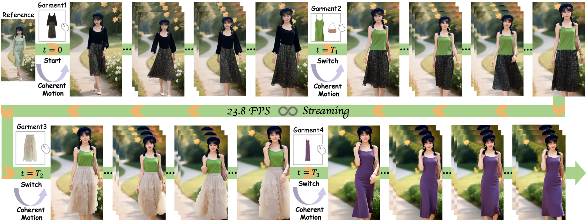
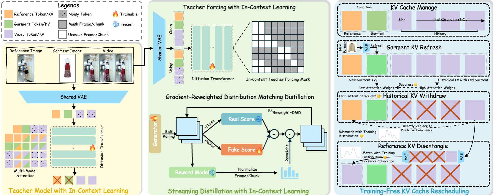
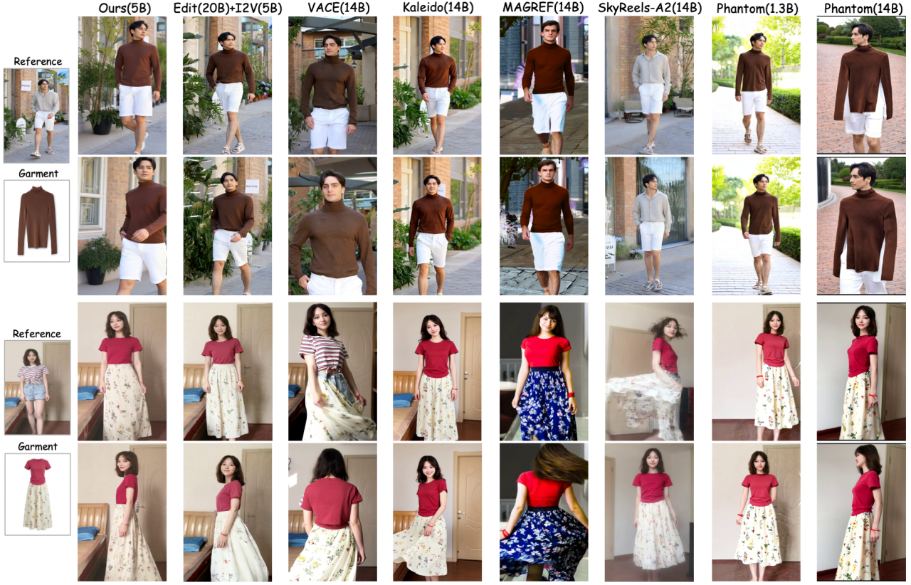
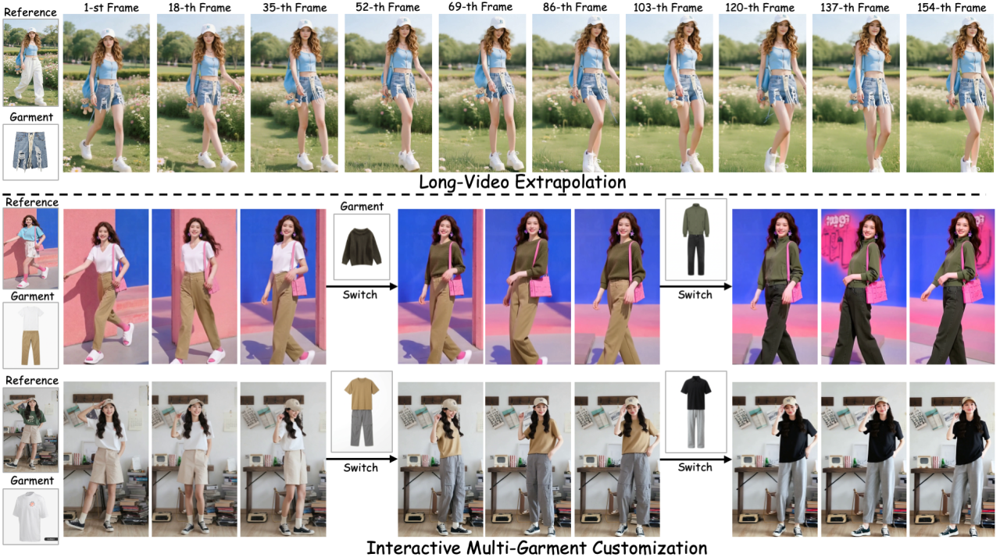

<div align="center">
<h1>

FashionChameleon: Towards Real-Time and Interactive Human-Garment Video Customization
</h1>

<p align="center">
    <span>
        <a href="https://arxiv.org/pdf/2605.15824" target="_blank"> 
        </a> &emsp;  &emsp; 
    </span>
    <span> 
        <a href='https://quanjiansong.github.io/projects/FashionChameleon' target="_blank">
        </a>  &emsp;  &emsp;
    </span>
    <br>
    <span> 
        <a href='https://huggingface.co/papers/2605.15824' target="_blank"> 
        </a> &emsp;  &emsp;
    </span>
    <span> 
        <a href='https://huggingface.co/datasets/QuanjianSong/HGC-Bench' target="_blank"> 
        </a> &emsp;  &emsp;
    </span>
</p>

<br/>

<div align="center">
<b>TL;DR:</b><br/>
We propose <span className="text-white font-medium">FashionChameleon</span>, a real-time and interactive framework for human-garment customization in streaming autoregressive video generation.  
It achieves real-time generation at 23.8 FPS on a single GPU.
</div>



</div>


## 📅 Todo
- [ ] Release the checkpoint.
- [ ] Release the code of post-training.
- [ ] Release the code of pre-training.
- [x] 🔥 Release the HGC-Bench.
- [x] 🔥 Release the <a href="https://quanjiansong.github.io/projects/FashionChameleon/" target="_blank">project page</a>.
- [x] 🔥 Release the <a href="https://arxiv.org/pdf/2605.15824" target="_blank">technical report</a>.


## ✨ Highlight
> **1. Interactive Customization.** We train a single-garment switching teacher using tailored I2V priors and mismatched reference–garment pairs. During generation, we introduce KV-cache rescheduling to enable interactive multi-garment customization without requiring video data containing multi-garment switching.

> **2. Gradient-Reweighted DMD.** Traditional self-forcing treats all self-rolled frames equally during DMD backpropagation. However, later frames typically suffer from larger quality degradation and thus require stronger gradient supervision. We dynamically reweight DMD gradients during self-rolling using a reward model to improve extrapolation consistency.

> **3. Real-Time Generation.** Through streaming distillation with in-context learning, FashionChameleon achieves 23.8 FPS for 720p generation on a single H200 GPU, 30–180× faster than existing customization methods.


## 🎬 Overview
Human-centric video customization, particularly at the garment level, has shown significant commercial value. However, existing approaches cannot support low-latency and interactive garment control, which is crucial for applications such as e-commerce and content creation. This paper studies how to achieve interactive multi-garment video customization while preserving motion coherence using only single-garment video data. We present FashionChameleon, a real-time and interactive framework for human-garment customization in autoregressive video generation, where users can interactively switch garment during generation. FashionChameleon consists of three key techniques: (i) Instead of training on multi-garment video data, we train a Teacher Model with In-Context Learning on a single reference–garment pair. By retaining the image-to-video training paradigm while enforcing a mismatch between the reference and garment image, the model is encouraged to implicitly preserve coherence during single-garment switching. (ii) To achieve consistency and efficiency during generation, we introduce Streaming Distillation with In-Context Learning, which fine-tunes the model with in-context teacher forcing and improves extrapolation consistency via gradient-reweighted distribution matching distillation. (iii) To extend the model for interactive multi-garment video customization, we propose Training-Free KV Cache Rescheduling, which includes garment KV refresh, historical KV withdraw, and reference KV disentangle to achieve garment switching while preserving motion coherence. Our FashionChameleon uniquely supports interactive customization and consistent long-video extrapolation, while achieving real-time generation at 23.8 FPS on a single GPU, 30-180× faster than existing baselines. Overall pipline is shown below:



## 🌈 Comparison



## 🌊 Application



## 🎓 Bibtex
🤗 If you find this code helpful for your research, please cite:
```
@article{song2026fashionchameleon,
  title={FashionChameleon: Towards Real-Time and Interactive Human-Garment Video Customization},
  author={Song, Quanjian and Shen, Yefeng and Chen, Mengting and Sun, Hao and Lan, Jinsong and Zhu, Xiaoyong and Zheng, Bo and Cao, Liujuan},
  journal={arXiv preprint arXiv:2605.15824},
  year={2026}
}
```
